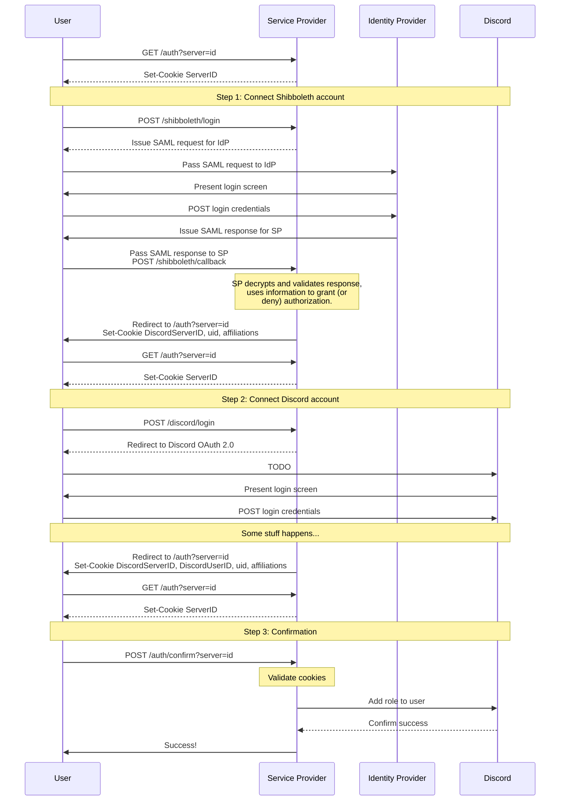

```mermaid
sequenceDiagram
participant User
participant Service Provider
participant Identity Provider
User ->> Service Provider: GET /auth?server=id
Service Provider -->> User: Set-Cookie ServerID
Note over User, Discord: Step 1: Connect Shibboleth account
User ->> Service Provider: POST /shibboleth/login
Service Provider -->> User: Issue SAML request for IdP
User ->> Identity Provider: Pass SAML request to IdP
Identity Provider ->> User: Present login screen
User ->> Identity Provider: POST login credentials
Identity Provider ->> User: Issue SAML response for SP
User ->> Service Provider: Pass SAML response to SP <br />POST /shibboleth/callback
Note over Service Provider: SP decrypts and validates response, <br /> uses information to grant (or <br />deny) authorization.
Service Provider ->> User: Redirect to /auth?server=id <br />Set-Cookie DiscordServerID, uid, affiliations
User ->> Service Provider: GET /auth?server=id
Service Provider -->> User: Set-Cookie ServerID
Note over User, Discord: Step 2: Connect Discord account
User ->> Service Provider: POST /discord/login
Service Provider -->> User: Redirect to Discord OAuth 2.0
User ->> Discord: TODO
Discord ->> User: Present login screen
User ->> Discord: POST login credentials
Note over User, Discord: Some stuff happens...
Service Provider ->> User: Redirect to /auth?server=id <br />Set-Cookie DiscordServerID, DiscordUserID, uid, affiliations
User ->> Service Provider: GET /auth?server=id
Service Provider -->> User: Set-Cookie ServerID
Note over User, Discord: Step 3: Confirmation
User ->> Service Provider: POST /auth/confirm?server=id
Note over Service Provider: Validate cookies
Service Provider ->> Discord: Add role to user
Discord -->> Service Provider: Confirm success
Service Provider ->> User: Success!
```
